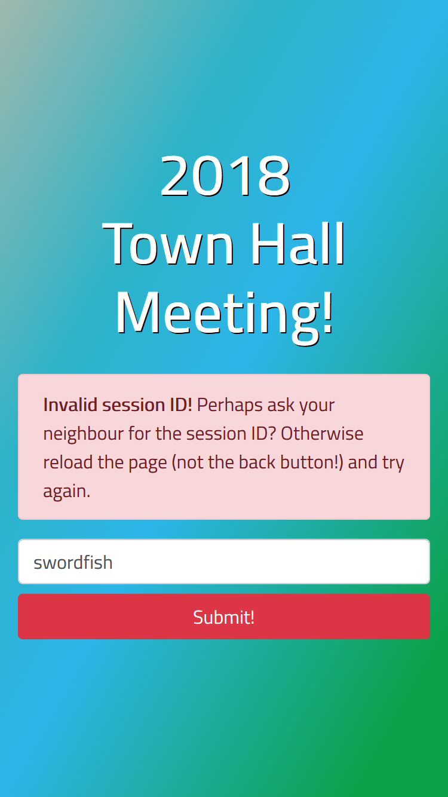
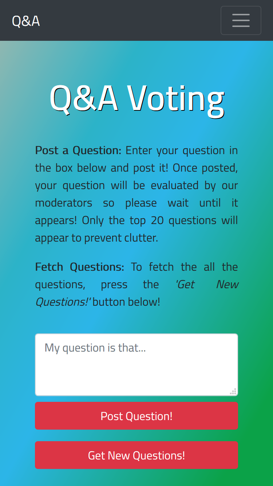
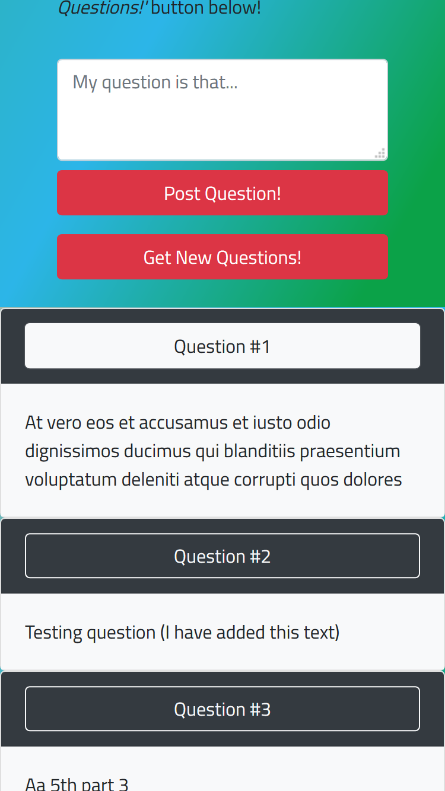

Project Vote: I Vote Lincoln!
-----------------------------

  
  
  
  

Project Vote is a web application written with Django that was used as the 
realtime Q&A tool for a company wide event named "Town Hall". This
event took place on 16th December 2018 with an audience of 3,000 people.
See the [Key Features](#Key-Features) section below for an overview.

Prerequisites
-------------
- Python 3+ (see requirements.txt file)
- Django 2.1.4+
- Gunicorn 19.9.0+ (only for deployment)
- Nginx 1.14.2+ (only for deployment)

How to Run (Development)
------------------------
1. Install all the dependencies (e.g. `pip install -r requirements.txt`).
2. Run the django development server via `cd vote && python manage.py runserver`.
3. Launch a browser and connect to the server (e.g. 127.0.0.1:8000).
4. To get past the login page, create a new session ID by creating a new user account in the backend.
    `python manage.py migrate`
    `python manage.py createsuperuser`      # IMPORTANT: Username=<SESSION_ID>, password=defaultuser

Q&A Flow
--------
    1. A user logs into the frontend webpage via a given session ID.
    2. The user can view existing questions.
    3. The user can post a new question if not already asked.
    4. The submitted question is first sent to the backend.
    5. Moderators access the backend via <URL>/admin.
    6. The moderator can control the following flags per question:
       `isAppropriate` flag: Appear on frontend?
       `isAnswered` flag: Change question color to green on frontend?
       `votes`:  An internal ranking of questions to help moderation.
               

Key Features
------------
- **Authentication:** Requires logging via session ID.
- **Realtime Q&A:** Allows posting and viewing of moderated questions.
- **Moderation:** Questions posted are sent to backend for moderation first.
- **Capacity:** ~2,000 clients. 

Note: The bottleneck of the web application is the authentication page which 
can only support 2,000 HTTP requests within 1 minute (tested with Gunicorn
and Nginx). Other pages support more than 10,000 HTTP requests per minute.

As a reference, the django development server can support around 1500 clients 
(though it is ill advised to use the development server for production! Use 
Nginx with Gunicorn instead).

Authors
-------
- Othman Alikhan
- See About page for more details.
